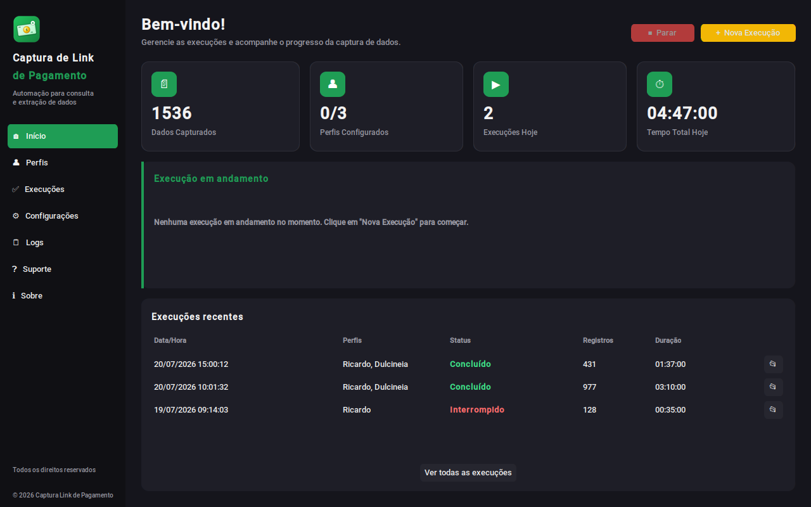
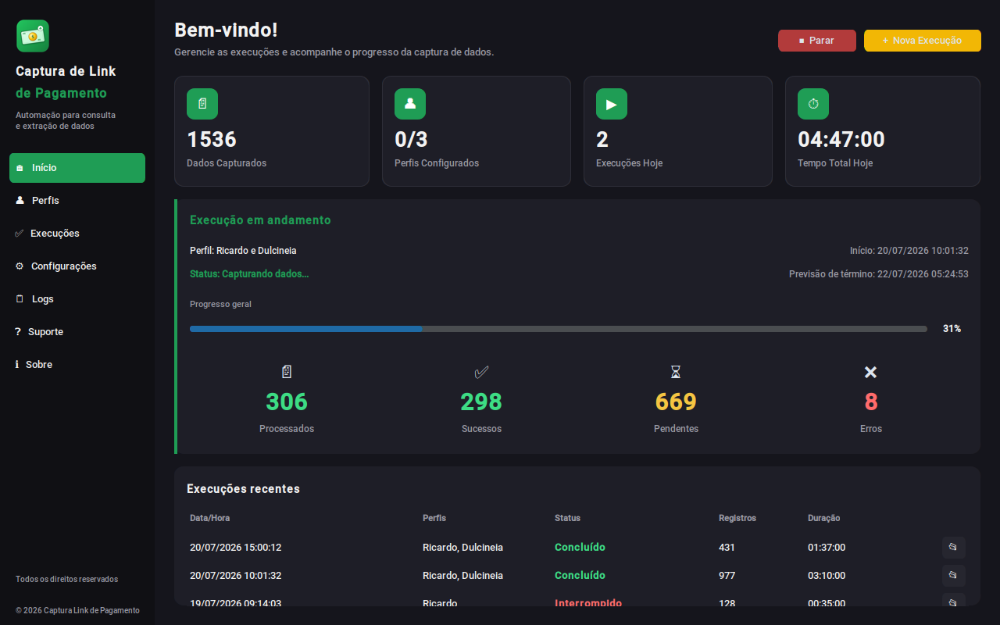
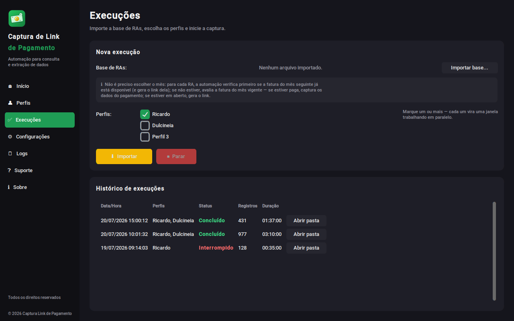
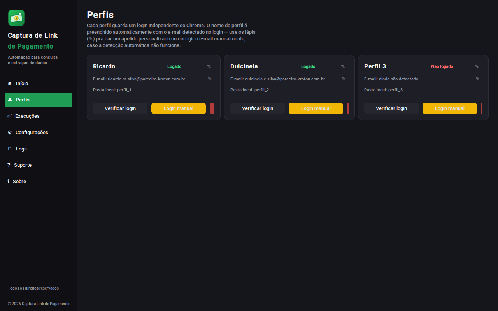

# Captura Link de Pagamento

Automação para consultar alunos no CRM Dynamics (Kroton/Anhanguera),
verificar a situação financeira e gerar o link de pagamento das
mensalidades em aberto — em lote, a partir de uma planilha de RAs, com
interface gráfica própria e sem precisar tocar no CRM manualmente.



## Índice

- [O que o programa faz](#o-que-o-programa-faz)
- [Base de entrada e arquivos gerados](#base-de-entrada-e-arquivos-gerados)
- [Funcionalidades](#funcionalidades)
- [Capturas de tela](#capturas-de-tela)
- [Instalação (uso final — sem Python)](#instalação-uso-final--sem-python)
- [Instalação (desenvolvimento)](#instalação-desenvolvimento)
- [Como usar](#como-usar)
- [Estrutura do projeto](#estrutura-do-projeto)
- [Gerando o executável (.exe)](#gerando-o-executável-exe)
- [Chrome e driver](#chrome-e-driver)
- [Solução de problemas comuns](#solução-de-problemas-comuns)
- [Suporte](#suporte)

## O que o programa faz

Você importa uma planilha (CSV ou Excel) com uma coluna de RAs. Pra cada
RA, a automação:

1. Busca o aluno no CRM.
2. Confere o cadastro (nome completo, CPF, celular, e-mail, curso).
3. Verifica a situação financeira (Adimplente/Inadimplente).
4. Checa a mensalidade do mês seguinte primeiro; se não estiver
   disponível, avalia a do mês vigente.
5. Se a fatura já estiver **paga** ou **negociada**, só traz os dados —
   não gera link. Caso contrário, gera o link de pagamento.
6. Registra tudo (inclusive erros) numa planilha de saída.

Cada execução é **independente**: não existe histórico de "RA já
processado" travando nada — a mesma base pode ser reimportada quantas
vezes for preciso ao longo do mês, atualizando quem ainda não pagou.

## Base de entrada e arquivos gerados

### Base de entrada

- Formato: CSV ou Excel (`.xlsx` / `.xls`).
- O **RA fica na primeira coluna**; o cabeçalho é opcional. Só a primeira
  coluna é lida — outras colunas (inclusive telefone) são ignoradas. O
  celular de cada aluno vem do cadastro no CRM.
- RAs repetidos são processados todas as vezes que aparecem.
- Linhas vazias são ignoradas.

### Arquivos gerados

Cada execução cria uma pasta `Documentos/CapturaLinkPagamento/saida/
AAAA-MM-DD_HH-MM-SS/` com três arquivos, **cada um em CSV (separado por
`;`, UTF-8) e em Excel**:

| Arquivo | Conteúdo |
|---|---|
| `resultado` | Resumo técnico, uma linha por RA: RA, perfil, CPF, nome, celular, e-mail, curso, situação, mensalidade encontrada, competência, ano, valor atualizado, **vencimento**, dados de pagamento, link, data/hora do link, resultado e status da consulta. É a base do botão *Reprocessar erros*. |
| `relatorio_meses` | Visão completa, uma linha por aluno. Colunas: `RA`, `Nome`, `CPF`, `Telefone`, `Situação` e, para **cada mês de junho a dezembro**, quatro colunas: `<Mês> - Situacao Mensalidade`, `<Mês> - Valor Pago`, `<Mês> - Vencimento` e `<Mês> - Link Pagamento`. |
| `base_disparo` | Arquivo enxuto para disparo, uma linha por aluno. Colunas: `RA`, `CPF`, `Nome`, `Telefone`, `MÊS`, `Vencimento` e o link (`<Mês> - Link Pagamento`). |

### Regra do link (`base_disparo`)

- Só entram alunos que **tiveram link de pagamento gerado**; quem está com
  tudo pago/negociado, sem mensalidade ou com erro fica de fora.
- Se o aluno tem mais de um link gerado (ex.: setembro e outubro em
  aberto), vale o da parcela de **vencimento mais recente**.
- `Telefone` sai no formato `55` + DDD + número (numérico). Sem telefone
  válido no cadastro, o aluno continua na base, com o campo em branco.
- Faturas **pagas** ou **negociadas** não geram link; o vencimento delas
  aparece só no `relatorio_meses`.
- O período do `relatorio_meses` (hoje junho a dezembro/2026) é ajustado em
  `config.py` (`MES_MINIMO_RELATORIO` ... `ANO_MAXIMO_RELATORIO`).

## Funcionalidades

- **Até 3 perfis de login independentes**, rodando em paralelo (cada
  janela do Chrome com sua própria sessão) — apelido editável, e-mail
  detectado automaticamente (ou editável na mão), verificação de login,
  limpar perfil.
- **Painel de acompanhamento em tempo real**: progresso, previsão de
  término, Processados/Sucessos/Pendentes/Erros.
- **Reinício automático do navegador** se a sessão do Chrome morrer no
  meio de uma execução (crash, falta de memória, etc.) — sem isso, todo
  RA restante falharia em cascata; com isso, só reinicia e continua de
  onde parou.
- **Botão "Reprocessar erros"** no histórico — gera automaticamente uma
  nova base só com os RAs que deram erro numa execução, pronta pra
  reimportar.
- **Log de retomada**: se o programa cair no meio de uma execução
  (queda de energia, travamento), oferece recuperar os resultados
  parciais já capturados ao reabrir.
- **Screenshot automático** de qualquer erro, salvo com data/hora, pra
  facilitar diagnóstico.
- **Cada execução gera sua própria pasta** de saída (CSV + Excel),
  identificada por data/hora — nunca mistura arquivos de execuções
  diferentes.
- **Base de disparo** (`base_disparo`): um link por aluno, com vencimento e
  telefone no formato 55 + DDD + número, pronta para o disparo.
- **Zerar painel**: em *Configurações*, apaga números, histórico e pastas de
  saída pra começar outro polo do zero — sem mexer nos logins.
- **Manual do usuário completo**, embutido no programa (aba Suporte).

## Capturas de tela

| Início (execução em andamento) | Execuções | Perfis |
|---|---|---|
|  |  |  |

## Instalação (uso final — sem Python)

Se você só vai **usar** o programa (não desenvolver), não precisa
instalar Python nem nada disso — só:

1. Google Chrome instalado.
2. Conexão com a internet.
3. O executável `CapturaLinkPagamento.exe` (peça pra quem gera os
   builds, ou veja [Gerando o executável](#gerando-o-executável-exe)).

Na primeira vez que abrir numa máquina nova, pode ser necessário
liberar o certificado da empresa — veja `TI_LEIA_ISTO.md` e
`instalar_certificado.ps1` na raiz do projeto.

## Instalação (desenvolvimento)

```bash
git clone <url-deste-repositório>
cd CapturaLinkPagamento
pip install -r requirements.txt
python main.py
```

Requer Python 3.10+ e Google Chrome. O `webdriver-manager` cuida de
baixar a versão certa do ChromeDriver automaticamente na primeira
execução.

## Como usar

A interface é organizada em páginas, acessíveis pela barra lateral:

- **Início** — painel geral: dados capturados, perfis configurados,
  execuções de hoje, e o acompanhamento ao vivo de uma execução em
  andamento (progresso, previsão de término, métricas).
- **Perfis** — configure até 3 logins independentes do Chrome:
  - **Login manual** — abre uma janela do Chrome pra logar naquele
    perfil especificamente; o e-mail é detectado automaticamente.
  - **Verificar login** — checa rapidamente se o perfil ainda está
    autenticado no CRM.
  - **✎ (lápis)** — edita o apelido ou o e-mail manualmente, caso a
    detecção automática não funcione.
  - **Limpar perfil** — apaga login, apelido e e-mail só daquele
    perfil, sem afetar os outros.
- **Execuções** — importe a base de RAs, marque quais perfis vão
  trabalhar (qualquer combinação entre os 3) e clique em **Importar**.
  **Parar** interrompe a execução — sem fechar o navegador no meio de
  um RA. O histórico completo fica registrado, com botões **Abrir
  pasta** e **Reprocessar erros** por execução.
- **Configurações** — tema claro/escuro, local dos dados e a seção
  **Zerar painel (começar outro polo)**: apaga os números e o histórico do
  painel, todas as pastas de saída, os prints de erro e as bases de
  reprocessamento (o botão **Abrir pasta Saída** serve para copiar antes
  o que ainda precisar). Pede confirmação, não dá para desfazer, fica
  bloqueado durante uma execução e **nunca apaga perfis nem logins**.
- **Logs** — acompanhamento detalhado, linha a linha, em tempo real.
- **Suporte** — telefone, e-mail e botão **Abrir manual** (manual
  completo em PDF, com todas as telas explicadas).
- **Sobre** — versão do aplicativo.

### Passo a passo rápido

1. Abra o programa.
2. Vá em **Perfis** e, pra cada perfil que for usar, clique em **Login
   manual**, faça o login e feche a janela.
3. Vá em **Execuções** → **Importar base...** → selecione o arquivo →
   marque os perfis → **Importar**.
4. Acompanhe pela tela **Início** ou **Logs**. Pode interromper a
   qualquer momento com **Parar**.
5. Ao final, o programa oferece abrir a pasta com os arquivos de
   resultado (CSV + Excel).

## Estrutura do projeto

```
CapturaLinkPagamento/
├── main.py                    # ponto de entrada
├── app_gui.py                 # controlador principal da interface
├── crm_client.py              # toda a interação Selenium com o CRM
├── runner.py                  # orquestração dos perfis em paralelo
├── browser_manager.py         # gestão de perfis do Chrome e detecção de login
├── perfis.py                  # metadados dos perfis (apelido, e-mail, status)
├── history.py                 # histórico de execuções
├── recuperacao.py             # log de retomada em caso de queda
├── data_io.py                 # leitura de RAs e gravação dos resultados
├── config.py                  # seletores, caminhos, constantes gerais
├── estilo.py                  # paleta de cores e tema
├── paginas/                   # cada tela da interface
├── assets/                    # ícone, logo, manual (Word + PDF)
├── requirements.txt
├── CapturaLinkPagamento.spec  # configuração do PyInstaller
├── build_exe.bat              # gera e assina o .exe (Windows)
├── gerar_certificado.ps1      # gera o certificado de assinatura (uma vez)
├── assinar_exe.ps1            # assina o .exe (chamado pelo build_exe.bat)
├── instalar_certificado.ps1   # roda em cada máquina final, uma vez
├── LEIAME.md
├── LEIAME_EMPACOTAMENTO.md    # como gerar o .exe, passo a passo
└── TI_LEIA_ISTO.md            # guia pro TI liberar o certificado
```

## Gerando o executável (.exe)

O PyInstaller não faz build cruzado — o `.exe` precisa ser gerado numa
máquina **Windows**. Resumo (detalhes completos em
`LEIAME_EMPACOTAMENTO.md`):

```
build_exe.bat
```

Isso instala as dependências, gera o `.exe` em `dist\` e já assina com
o certificado da empresa, se ele existir (`gerar_certificado.ps1` — só
precisa rodar uma vez, na vida do projeto).

Antes de distribuir pra qualquer máquina nova, rode
`instalar_certificado.ps1` nela (uma vez), pra evitar o aviso de
"arquivo bloqueado" do Windows. Veja `TI_LEIA_ISTO.md` para o guia
completo, incluindo o que fazer se a empresa usar AppLocker/WDAC.

## Chrome e driver

- O programa usa o **Google Chrome instalado** na máquina e o
  **ChromeDriver**, baixado automaticamente pelo `webdriver-manager` na
  primeira execução (precisa de internet; leva de 10 a 30 segundos). Ele
  fica guardado na pasta `.wdm` dentro da pasta do usuário
  (`C:\Users\seu-usuário\.wdm`).
- Mantenha o Chrome atualizado: quando o Chrome atualiza, o driver
  correspondente é baixado de novo sozinho na próxima abertura.
- Se a rede da empresa bloquear o download do driver, libere o acesso ou
  peça ao TI para liberar.
- Cada perfil usa uma pasta própria de dados do Chrome em
  `%LOCALAPPDATA%\CapturaLinkPagamento\perfis`. Um perfil **não pode ser
  aberto duas vezes ao mesmo tempo**.

## Solução de problemas comuns

**"Chrome failed to start: crashed" / perfil perde o login do nada**
Quase sempre é a pasta de perfis do Chrome estar dentro de uma pasta
sincronizada por OneDrive/Google Drive — o sincronizador brigando com o
Chrome pelos mesmos arquivos causa corrupção. Este projeto já guarda os
perfis em `%LOCALAPPDATA%` (fora de qualquer sincronização) por esse
motivo exato.

**O Chrome não abre / erro de driver (`session not created`, `This version of ChromeDriver only supports...`)**
Feche todas as janelas do Chrome, apague a pasta `.wdm` dentro da pasta do
usuário (`C:\Users\seu-usuário\.wdm`) e abra o programa de novo — o driver
certo é baixado outra vez. Se persistir, confira a internet/proxy.

**Perfil em uso (`user data directory is already in use`)**
Já existe uma janela do Chrome aberta com aquele perfil (por exemplo, o
*Login manual* que não foi fechado, ou uma execução anterior travada).
Feche essa janela (ou finalize os processos `chrome.exe` e
`chromedriver.exe` no Gerenciador de Tarefas) e tente de novo.

**"invalid session id" em cascata (todo RA seguinte falha igual)**
Sinal de que a sessão do navegador morreu de vez no meio da execução —
o programa detecta isso automaticamente e reinicia o navegador sozinho,
continuando a partir do próximo RA (até 3 tentativas seguidas antes de
desistir daquele perfil).

**Windows bloqueia o `.exe` ("política de Controle de Aplicativo")**
Veja `TI_LEIA_ISTO.md` — geralmente é o certificado não instalado
(`instalar_certificado.ps1`) ou o Controle Inteligente de Aplicativos
do Windows 11 ativado (Configurações → Privacidade e segurança →
Segurança do Windows → Controle de aplicativos e do navegador).

**Campo vem em branco no resultado**
A coluna "Status da Consulta" mostra um aviso (`AVISO: campo(s) vazio(s)
- ...`) quando isso acontece mesmo sem erro explícito — vale conferir
esse RA manualmente no CRM.

## Suporte

Contato disponível dentro do próprio programa, na aba **Suporte** — ou
consulte o manual completo em PDF (`assets/manual.pdf`). Contato:
(11) 94727-8128 · samueldayvid5@icloud.com.
